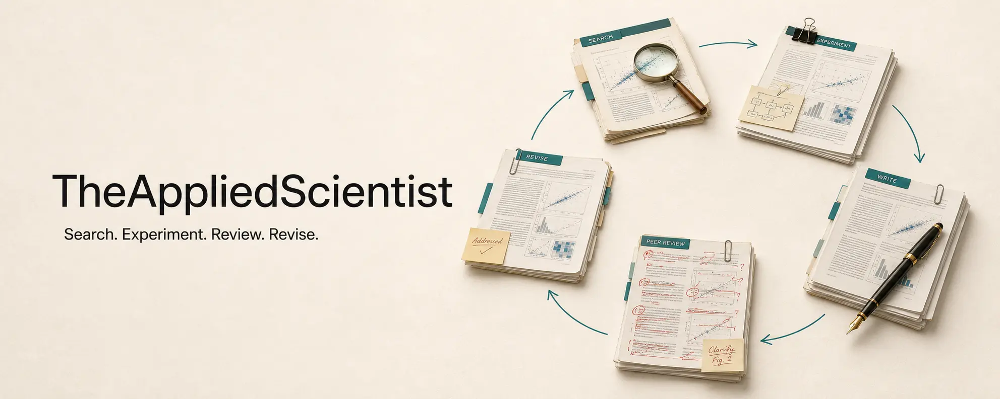
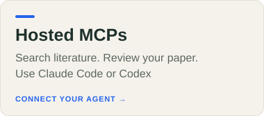
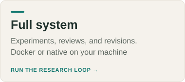
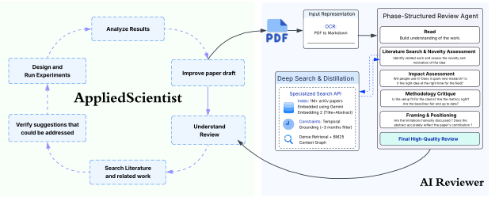

<p align="center">
  
</p>

<p align="center">
  <a href="https://arxiv.org/abs/2609.14738"></a>
  <a href="https://theappliedscientist.github.io/"></a>
  <a href="https://search.eigenlabs.online/docs"></a>
  <a href="https://review.eigenlabs.online/docs"></a>
  <a href="LICENSE"></a>
</p>

<h1 align="center">TheAppliedScientist</h1>

TheAppliedScientist searches literature, reviews papers, runs experiments, and revises manuscripts.

**Contents**

[Hosted MCPs](#use-search-and-review-with-mcp) · [Full setup](#run-the-complete-system-yourself) · [Your paper](#add-your-paper) · [Individual components](#run-individual-components) · [Docs](#documentation)

<table>
<tr>
<td width="33%"><a href="#use-search-and-review-with-mcp"></a></td>
<td width="33%"><a href="#run-the-complete-system-yourself"></a></td>
<td width="33%"><a href="#run-individual-components"></a></td>
</tr>
</table>

<a name="use-search-and-review-with-mcp"></a>

## 

In your paper's folder, run the block for your agent. Use Bash on Linux/macOS or WSL/Git Bash on Windows.

<details open>
<summary><strong>Claude Code</strong></summary>

```bash
claude mcp add --transport http appliedscientist-search https://search.eigenlabs.online/mcp
claude mcp add --transport http appliedscientist-review https://review.eigenlabs.online/mcp

mkdir -p .claude/skills/appliedscientist
curl -fsSL https://raw.githubusercontent.com/TheAppliedScientist/TheAppliedScientist/main/skills/appliedscientist/SKILL.md \
  -o .claude/skills/appliedscientist/SKILL.md
```

</details>

<details>
<summary><strong>Codex</strong></summary>

```bash
codex mcp add appliedscientist-search --url https://search.eigenlabs.online/mcp
codex mcp add appliedscientist-review --url https://review.eigenlabs.online/mcp

mkdir -p .agents/skills/appliedscientist
curl -fsSL https://raw.githubusercontent.com/TheAppliedScientist/TheAppliedScientist/main/skills/appliedscientist/SKILL.md \
  -o .agents/skills/appliedscientist/SKILL.md
```

No login is needed. Ignore Codex's suggestion to run `codex mcp login`.

</details>

Open or restart your agent in that folder and try one of these requests.

| Review | Search |
| --- | --- |
| `Use the AppliedScientist skill to review papers/draft.pdf.` | `Use the AppliedScientist skill to find papers on test-time adaptation.` |
| `Use the AppliedScientist skill to review paper-source.zip.` | `Use the AppliedScientist skill to find papers related to arXiv:1706.03762.` |

> Your agent uploads the file and retrieves the review. The Reviewer handles its own literature searches.

**Review limits**

20 MB per file · first 12 rendered pages · several minutes plus queue time.

[File formats](docs/hosted-tools.md) · [Usage skill](skills/appliedscientist/SKILL.md) · [Search API docs](https://search.eigenlabs.online/docs) · [Review API docs](https://review.eigenlabs.online/docs)

<a name="run-the-complete-system-yourself"></a>

## 

### 1. Install prerequisites and clone

| Choose a runtime | Prerequisites |
| --- | --- |
| **Docker** | Python 3.12, Git, Docker Engine 27+, Compose 2.30+ |
| **Native, without Docker** | Python 3.12, Node.js 22, Git, uv, and [research tools](docs/installation.md) |

Install on [Linux](docs/installation.md#linux) · [macOS](docs/installation.md#macos) · [Windows / WSL 2](docs/installation.md#windows)

Allow about **20 GB** for Search/Reviewer or **60 GB** for Docker GPU runs. Search downloads a 13 GB index once.

```bash
git clone https://github.com/TheAppliedScientist/TheAppliedScientist.git
cd TheAppliedScientist
```

### 2. Prepare API keys

Setup asks for these values and saves them in `.env`.

| Component | Have ready |
| --- | --- |
| Search embeddings | A [Gemini API key](https://ai.google.dev/gemini-api/docs/api-key) |
| Search full-paper answers | Uses the same Gemini key with `gemini-3-flash-preview` by default |
| AI Reviewer | Endpoint URL, API key, and model name |
| AI Scientist | Endpoint URL, API key, and model name |

> **Reviewer and Scientist need Anthropic-compatible endpoints.** OpenAI-only endpoints need a converter for Claude Code. [Provider settings](docs/llm-providers.md).

To change Search's answer model, edit `SEARCH_QUERY_*` in `.env` **after setup, before startup**. [Examples](docs/llm-providers.md#search).

### 3. Install components and start the APIs

Choose **one** runtime.

<details open>
<summary><strong>Docker (Search on the host; Reviewer and Scientist in containers)</strong></summary>

```bash
./tas setup search reviewer scientist --runtime docker
./tas doctor
./tas up
./tas smoke
```

Add `--dockerize-search` to setup if you also want Search in Docker.

</details>

<details>
<summary><strong>Native (without Docker)</strong></summary>

```bash
./tas setup search reviewer scientist --runtime native
./tas doctor
./tas up
./tas smoke
```

</details>

Search runs on port **8081** and Reviewer on **8082**. `smoke` tests Search retrieval and Reviewer health.

**Add your paper below, then start TheAppliedScientist.**

<a name="add-your-paper"></a>

## 

### 4. Place your files

Inside the cloned repository, open **`components/ai-scientist/user-ideas/`**. Use this folder layout.

```text
user-ideas/
├── my-paper.json             ← the configuration you create in step 5
└── my-paper/
    ├── paper-source/         ← your complete LaTeX project
    │   ├── main.tex
    │   ├── references.bib
    │   └── figures/
    ├── code/                 ← your experiment code, strongly recommended
    └── reviews.md            ← paste all existing reviews here
```

Use your actual LaTeX filenames. Include any style files and other source dependencies.

If you have no reviews, omit `reviews.md` and set `Human_Reviews_From_OpenReview` to `false`. If you have no code, omit `code/` and remove `code_path`.

### 5. Create `my-paper.json`

These paths start from the folder containing **`my-paper.json`**. Absolute paths work too.

```json
{
  "Name": "my_paper",
  "Title": "My Paper",
  "Task": "Read the paper, public reviews, and code. Reproduce the main result, address the reviewer concerns with real experiments, revise the paper, and continue iterating with the AI Reviewer.",
  "Paper": {
    "local_path": "my-paper/paper-source",
    "code_path": "my-paper/code"
  },
  "Human_Reviews_From_OpenReview": {
    "source_file": "my-paper/reviews.md"
  },
  "What_NOT_To_Do": "Do not fabricate results, citations, or experiments.",
  "GPU_Needed": false
}
```

<details>
<summary><strong>No reviews, no code, or GPU experiments?</strong></summary>

| Your case | JSON change |
| --- | --- |
| No existing reviews | Set `"Human_Reviews_From_OpenReview": false`. |
| No experiment code | Remove `code_path`; describe what can be reproduced in `Task`. |
| GPU experiments | Set `"GPU_Needed": true`. |

For papers without reviews, use this `Task`.

> Read the paper and code. Reproduce the main result, use Search to find gaps, test improvements with experiments, revise the paper, and iterate with the AI Reviewer.

[Other input formats and complete examples](docs/paper-task-files.md).

</details>

### 6. Start TheAppliedScientist

From the **repository root**, run the command for your runtime.

```bash
# Docker
./tas run components/ai-scientist/user-ideas/my-paper.json -- --timeout 21600

# Native, without Docker
./tas run --runtime native components/ai-scientist/user-ideas/my-paper.json -- --timeout 21600
```

For GPU experiments in Docker, complete [NVIDIA setup](docs/installation.md#nvidia-gpu), then add `--gpus 1`. Native mode uses host devices directly.

**Run limit:** six hours in these examples

**Outputs**

`components/ai-scientist/jobs/my-paper__<timestamp>/`

Experiment code · results · figures · paper source/PDF · review history · agent trajectory.

<a name="run-individual-components"></a>

## 

Install the [prerequisites](docs/installation.md), then choose what to run.

| Component | Install | Start |
| --- | --- | --- |
| Search API | `./tas setup search --runtime native` | `./tas up search` |
| AI Reviewer | `./tas setup reviewer --runtime docker` | `./tas up reviewer` |
| AI Scientist | `./tas setup scientist --runtime docker` | `./tas run components/ai-scientist/user-ideas/my-paper.json` |

Use `--runtime native` for Reviewer or Scientist without Docker. Setup asks only for the selected components' credentials.

| Component | Required APIs |
| --- | --- |
| AI Reviewer | A running Search API |
| AI Scientist | Running Search and Review APIs |

[Set the service URLs / use separate machines](docs/deployment.md#individual-components) · [Host your own public APIs and MCPs](deploy/hosted/README.md)

## How it works

<p align="center">
  
</p>

The Scientist runs experiments and revises the paper. Each independent review guides the next revision. Code, results, and drafts carry forward.

<a name="documentation"></a>

## 

| Guide | Contents |
| --- | --- |
| [Hosted MCPs](docs/hosted-tools.md) | Supported files, usage, review limits |
| [Installation](docs/installation.md) | Linux, macOS, Windows/WSL, Docker, native, GPU |
| [API keys and models](docs/llm-providers.md) | Gemini embeddings, Search answer models, agent endpoints |
| [Deployment](docs/deployment.md) | Individual components, separate machines, service commands |
| [Paper inputs](docs/paper-task-files.md) | Source, code, reviews, public URLs |
| [Original experiment setup](docs/reproducing-experiments.md) | Reference prompts, versions, compatibility checks |

<details>
<summary><strong>Service commands and sharing outputs</strong></summary>

```bash
./tas status          # service health
./tas doctor          # configuration checks
./tas logs search     # follow Search logs
./tas logs reviewer   # follow Reviewer logs
./tas down            # stop services
```

Docker research jobs can control Docker through its socket. Native jobs execute on the host. Use a dedicated research machine; keep `.env` and raw trajectories private. [Publishing outputs safely](docs/deployment.md#outputs-and-secrets).

</details>

[MIT license](LICENSE). Bundled dependencies retain their original notices.
